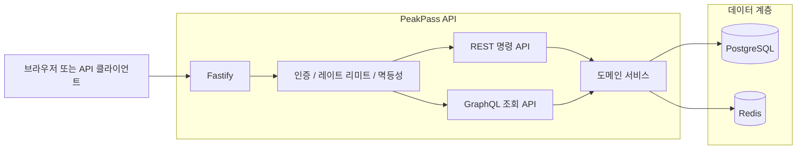
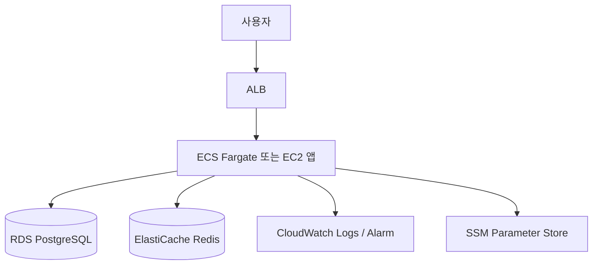
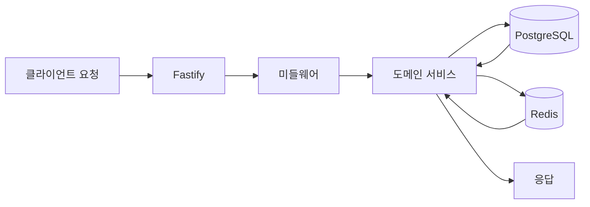
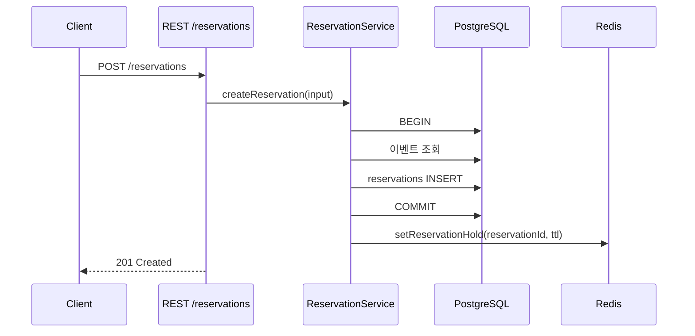
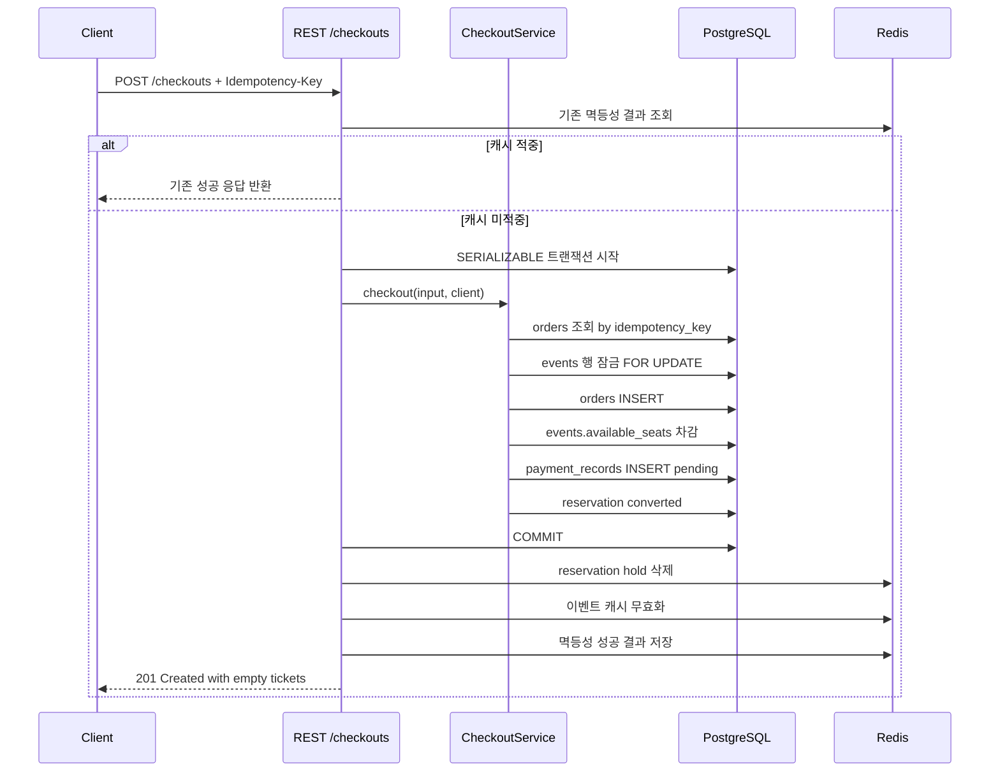
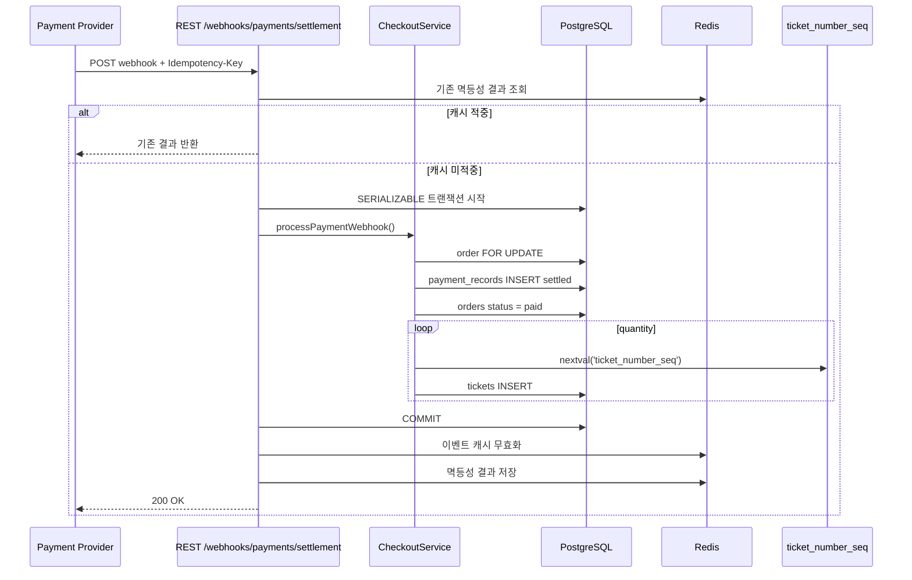

# 아키텍처 다이어그램

이 문서는 현재 저장소 기준의 구조를 간단하게 보여준다.  
설명 대상은 `Fastify + REST write-side + GraphQL read-side + PostgreSQL + Redis` 조합이다.

## 시스템 아키텍처

## 배포 구조

로컬 기준은 `docker-compose.yml`, 운영 기준은 `terraform/` 디렉터리의 AWS 리소스를 따른다.

## 데이터 흐름

## 시퀀스 다이어그램

### 예약 hold 생성

### 체크아웃

### settlement webhook과 패스 발급

## 현재 상태 메모

- 예약 hold와 멱등성 결과는 Redis를 사용하지만, 정합성 기준은 PostgreSQL이다.
- checkout 핵심 경로는 트랜잭션과 행 잠금으로 보호한다.
- 티켓은 checkout 직후가 아니라 settlement webhook 이후에 발급된다.
- duplicate settlement webhook에도 티켓이 중복 발급되지 않도록 구현되어 있다.
