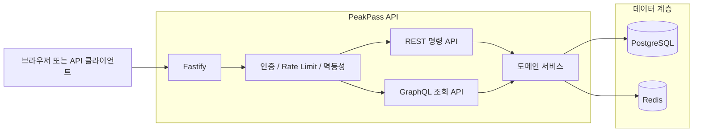
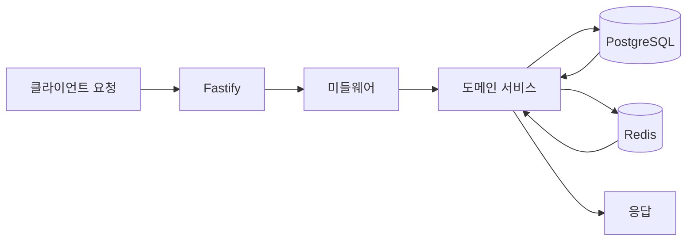
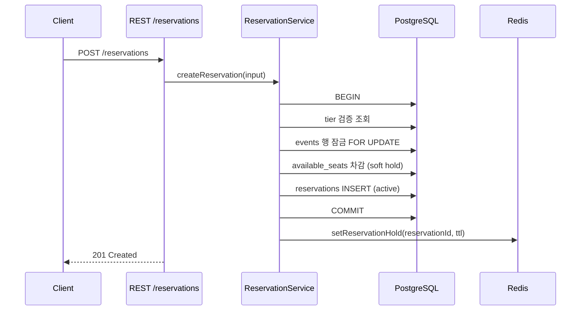
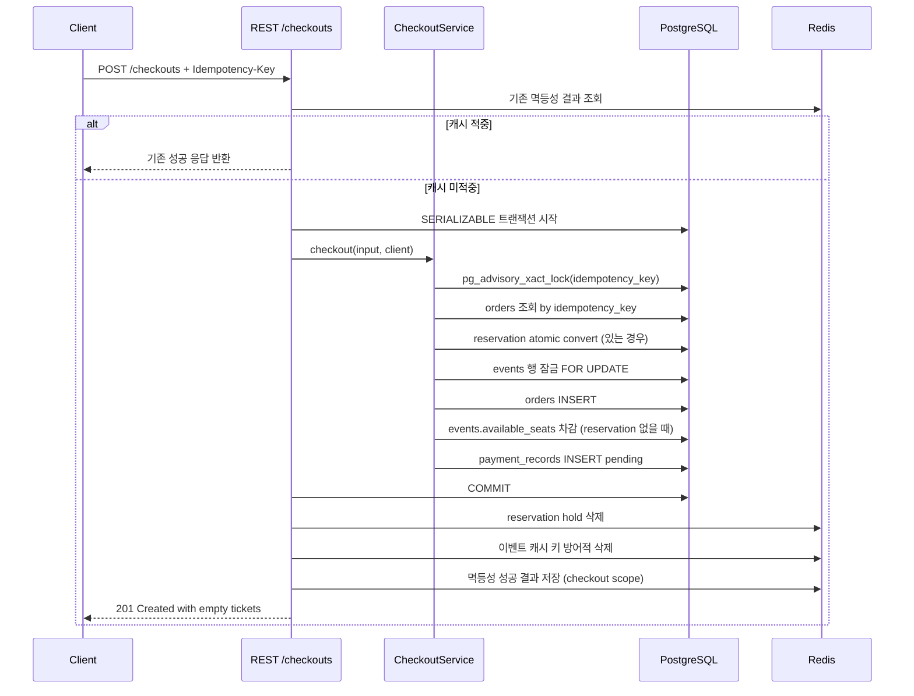
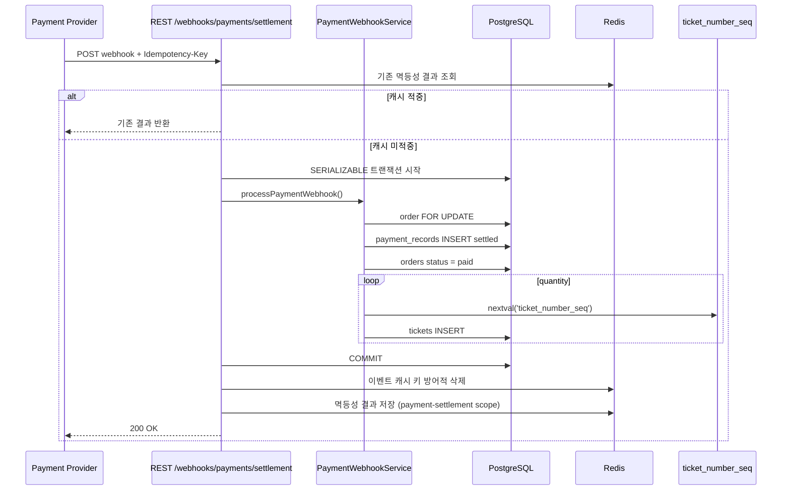

# 아키텍처 다이어그램

이 문서는 현재 저장소 기준의 구조를 간단하게 보여줍니다.
설명 대상은 `Fastify + REST write-side + GraphQL read-side + PostgreSQL + Redis` 조합입니다.

## 시스템 아키텍처

```mermaid
flowchart LR
    Client[브라우저 또는 API 클라이언트]

    subgraph App[PeakPass API]
      Fastify[Fastify]
      REST[REST 명령 API]
      GQL[GraphQL 조회 API]
      MW[인증 / Rate Limit / 멱등성]
      Service[도메인 서비스]
    end

    subgraph Data[데이터 계층]
      PG[(PostgreSQL)]
      Redis[(Redis)]
    end

    Client --> Fastify
    Fastify --> MW
    MW --> REST
    MW --> GQL
    REST --> Service
    GQL --> Service
    Service --> PG
    Service --> Redis
```

## 데이터 흐름

```mermaid
flowchart LR
    A[클라이언트 요청]
    B[Fastify]
    C[미들웨어]
    D[도메인 서비스]
    E[(PostgreSQL)]
    F[(Redis)]
    G[응답]

    A --> B
    B --> C
    C --> D
    D --> E
    D --> F
    E --> D
    F --> D
    D --> G
```

## 시퀀스 다이어그램

### 예약 hold 생성

```mermaid
sequenceDiagram
    participant C as Client
    participant API as REST /reservations
    participant S as ReservationService
    participant PG as PostgreSQL
    participant R as Redis

    C->>API: POST /reservations
    API->>S: createReservation(input)
    S->>PG: BEGIN
    S->>PG: tier 검증 조회
    S->>PG: events 행 잠금 FOR UPDATE
    S->>PG: available_seats 차감 (soft hold)
    S->>PG: reservations INSERT (active)
    S->>PG: COMMIT
    S->>R: setReservationHold(reservationId, ttl)
    API-->>C: 201 Created
```

### 체크아웃

```mermaid
sequenceDiagram
    participant C as Client
    participant API as REST /checkouts
    participant S as CheckoutService
    participant PG as PostgreSQL
    participant R as Redis

    C->>API: POST /checkouts + Idempotency-Key
    API->>R: 기존 멱등성 결과 조회
    alt 캐시 적중
        API-->>C: 기존 성공 응답 반환
    else 캐시 미적중
        API->>PG: SERIALIZABLE 트랜잭션 시작
        API->>S: checkout(input, client)
        S->>PG: pg_advisory_xact_lock(idempotency_key)
        S->>PG: orders 조회 by idempotency_key
        S->>PG: reservation atomic convert (있는 경우)
        S->>PG: events 행 잠금 FOR UPDATE
        S->>PG: orders INSERT
        S->>PG: events.available_seats 차감 (reservation 없을 때)
        S->>PG: payment_records INSERT pending
        API->>PG: COMMIT
        API->>R: reservation hold 삭제
        API->>R: 이벤트 캐시 키 방어적 삭제
        API->>R: 멱등성 성공 결과 저장 (checkout scope)
        API-->>C: 201 Created with empty tickets
    end
```

### settlement webhook과 패스 발급

```mermaid
sequenceDiagram
    participant P as Payment Provider
    participant API as REST /webhooks/payments/settlement
    participant S as PaymentWebhookService
    participant PG as PostgreSQL
    participant R as Redis
    participant Seq as ticket_number_seq

    P->>API: POST webhook + Idempotency-Key
    API->>R: 기존 멱등성 결과 조회
    alt 캐시 적중
        API-->>P: 기존 결과 반환
    else 캐시 미적중
        API->>PG: SERIALIZABLE 트랜잭션 시작
        API->>S: processPaymentWebhook()
        S->>PG: order FOR UPDATE
        S->>PG: payment_records INSERT settled
        S->>PG: orders status = paid
        loop quantity
          S->>Seq: nextval('ticket_number_seq')
          S->>PG: tickets INSERT
        end
        API->>PG: COMMIT
        API->>R: 이벤트 캐시 키 방어적 삭제
        API->>R: 멱등성 결과 저장 (payment-settlement scope)
        API-->>P: 200 OK
    end
```

## 현재 상태 메모

- 예약 hold와 멱등성 결과는 Redis를 사용하지만, 정합성 기준은 PostgreSQL임
- Redis 멱등성 캐시·lock은 command(checkout / payment-settlement)별 namespace로 분리됨
- 이벤트/재고 read-through cache는 미구현 — 조회는 PostgreSQL 직행 (다이어그램의 "캐시 키 방어적 삭제"는 향후 도입 대비 hook)
- Redis TTL 만료 자체는 좌석을 복구하지 않으며, background sweeper와 checkout lazy expiration이 DB에서 복구함
- checkout 핵심 경로는 트랜잭션·행 잠금·advisory lock으로 보호함
- 티켓은 checkout 직후가 아니라 settlement webhook 이후에 발급됨
- duplicate settlement webhook에도 티켓이 중복 발급되지 않도록 구현되어 있음
- status 허용 집합과 좌석 하한·상한은 DB CHECK로도 강제됨 (migration 006~007)